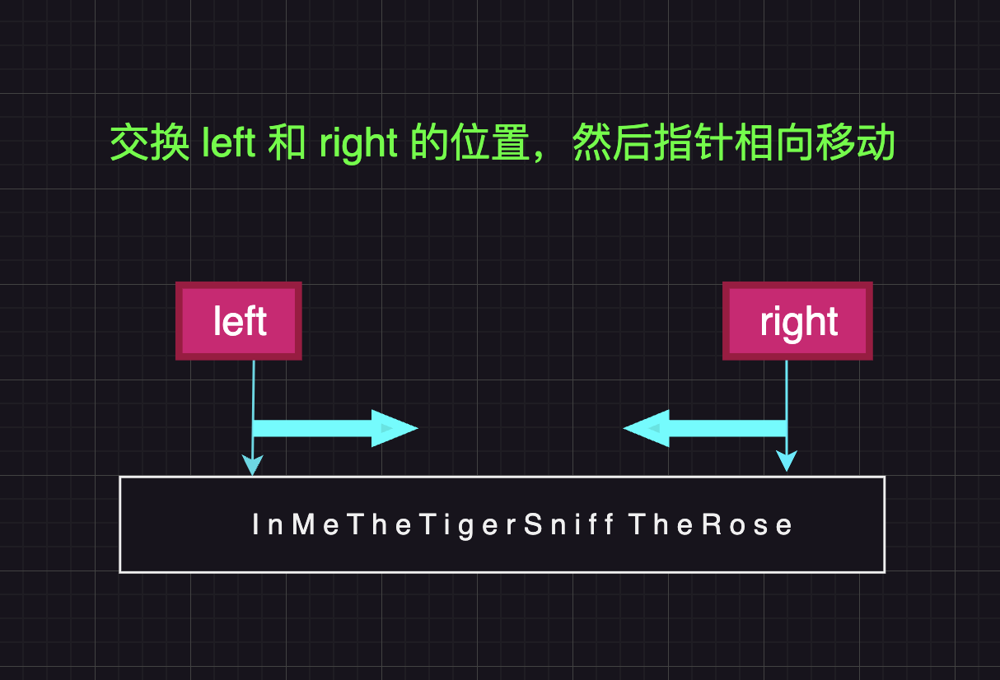
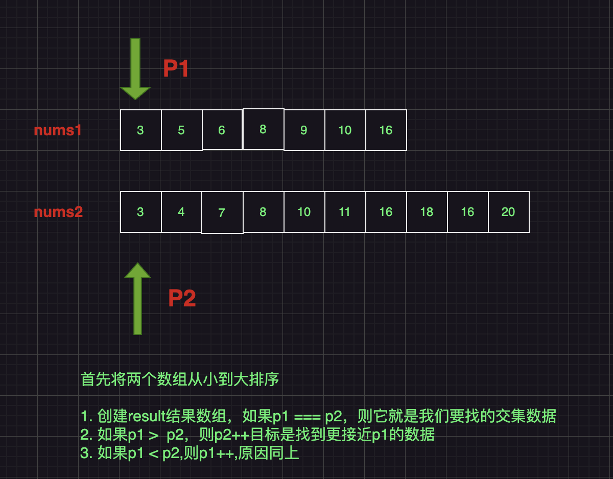

# frontend-algorithms

## 前端啃算法专项

渐进式收集整理算法相关知识比如高频算法题、手动实现数据结构如堆、栈、队列、链表、哈希表、二叉树、平衡搜索二叉树、红黑树、图等：

下面基础算法题来自力扣、豆包等渠道，链接了原文地址同时附带自己的解题思路，部分题目附图解。

📢📢📢 注意 📢

1. 每个题目的目录附带对应的 md 文档 和 题解，部分附带 xx.dio 图解
2. 请关注 ts 文件，忽略 js 文件，js 文件是为方便本地测试用 tsx 自动转译生成的

## 一、基础算法题

### `-Easy-`

- [爬楼梯-78-climbStairs](https://github.com/azx1573/frontend-algorithms/blob/master/src/algorithms/easy/climbStairs/index.ts) ✅
- [判断数组中是否存在重复元素-217-containsDuplicate](https://github.com/azx1573/frontend-algorithms/blob/master/src/algorithms/easy/containsDuplicate/index.ts) ✅
- [找出字符串中第一个匹配项的下标-28-findFirstIdxInStr](https://github.com/azx1573/frontend-algorithms/blob/master/src/algorithms/easy/findFirstIdxInStr/index.ts) ✅
- [字符串中的第一个唯一字符-387-firstUniqChar](https://github.com/azx1573/frontend-algorithms/blob/master/src/algorithms/easy/firstUniqChar/index.ts) ✅
- [求两数组的交集-力扣-350-intersectOfTwoArray](https://github.com/azx1573/frontend-algorithms/blob/master/src/algorithms/easy/intersectOfTwoArray/index.ts) ✅
- [验证回文字符串-125-isPalindrome](https://github.com/azx1573/frontend-algorithms/blob/master/src/algorithms/easy/isPalindrome/index.js) ✅
- [有效的括号-20-isValid](https://github.com/azx1573/frontend-algorithms/blob/master/src/algorithms/easy/isValid/index.js) ✅
- [最长的公共前缀-14-longCommonPrefix](https://github.com/azx1573/frontend-algorithms/blob/master/src/algorithms/easy/longCommonPrefix/index.js) ✅
- [合并两个有序数组-88-mergeArray](https://github.com/azx1573/frontend-algorithms/blob/master/src/algorithms/easy/mergeArray/index.ts) ✅
- [合并两个升序链表-21-mergeTwoLists](https://github.com/azx1573/frontend-algorithms/blob/master/src/algorithms/easy/mergeTwoLists/index.js) ✅
- [加一-66-plusOne](https://github.com/azx1573/frontend-algorithms/blob/master/src/algorithms/easy/plusOne/index.ts) ✅
- [删除有序数组中的重复项-26-removeSame](https://github.com/azx1573/frontend-algorithms/blob/master/src/algorithms/easy/removeSame/index.js) ✅
- [反转字符串-344-reverseString](https://github.com/azx1573/frontend-algorithms/blob/master/src/algorithms/easy/reverseString/index.ts) ✅
- [罗马数字转整数-13-remanToInt](https://github.com/azx1573/frontend-algorithms/blob/master/src/algorithms/easy/romanToInt/index.js) ✅
- [求 x 的平方根-69-sqrt](https://github.com/azx1573/frontend-algorithms/blob/master/src/algorithms/easy/sqrt/index.ts) ✅
- [求两数之和是否等于 target-1-sum](https://github.com/azx1573/frontend-algorithms/blob/master/src/algorithms/easy/sum/sumOfTarget.ts) ✅
- [两个字符串中相同字数-twoStrHaveSameCount](https://github.com/azx1573/frontend-algorithms/blob/master/src/algorithms/easy/twoStrHaveSameCount/index.ts) ✅
- [杨辉三角-118-yanghuiTriangle](https://github.com/azx1573/frontend-algorithms/blob/master/src/algorithms/easy/yanghuiTriangle/index.ts) ✅
- [小 U 的数字插入问题-numberInsert](https://github.com/azx1573/frontend-algorithms/blob/master/src/algorithms/easy/numberInsert/index.ts) ✅
- [买卖股票的最佳时机-121-maxProfitOfStock](https://github.com/azx1573/frontend-algorithms/blob/master/src/algorithms/easy/maxProfitOfStock/index.ts) ✅
- [fizzBuzz-412-fizzBuzz](https://github.com/azx1573/frontend-algorithms/blob/master/src/algorithms/easy/fizzBuzz/index.ts) ✅
- [是否是 3 的幂-326-isPowerOfThree](https://github.com/azx1573/frontend-algorithms/blob/master/src/algorithms/easy/isPowerOfThree/index.ts) ✅
- [缺失的数字-268-missingNumber](https://github.com/azx1573/frontend-algorithms/blob/master/src/algorithms/easy/missingNumber/index.ts) ✅
- [符串解密加扰字符串-findValidStr](https://github.com/azx1573/frontend-algorithms/blob/master/src/algorithms/easy/findValidStr/index.ts) ✅
- [分割字符串-splitString](https://github.com/azx1573/frontend-algorithms/blob/master/src/algorithms/easy/splitString/index.ts) ✅
- [寻找一个数的所有质数因子-findPrimeFactor](https://github.com/azx1573/frontend-algorithms/blob/master/src/algorithms/easy/findPrimeFactor/index.ts) ✅
- [将一个十进制数转换为二进制-switchBinary](https://github.com/azx1573/frontend-algorithms/blob/master/src/algorithms/easy/switchBinary/index.ts) ✅

### `-Middle-`

- [两数相加-2-addTwoNumNumbers](https://github.com/azx1573/frontend-algorithms/blob/master/src/algorithms/middle/addTwoNumbers/index.js) ✅
- [求无重复最长子串-3-lengthOfLongestSubstring](https://github.com/azx1573/frontend-algorithms/blob/master/src/algorithms/middle/lengthOfLongestSubstring/index.js) ✅
- [最少前缀操作问题-lessCount](https://github.com/azx1573/frontend-algorithms/blob/master/src/algorithms/middle/lessCount/index.ts) ✅
- [最小调整次数-华为笔试题-minAdjustments](https://github.com/azx1573/frontend-algorithms/blob/master/src/algorithms/middle/minAdjustments/index.js) ✅
- [二进制不进位等分苹果-华为笔试题-divideApple](https://github.com/azx1573/frontend-algorithms/blob/master/src/algorithms/middle/divideApple/index.js) ✅
- [部分人力分配-华为笔试题-calculateResult](https://github.com/azx1573/frontend-algorithms/blob/master/src/algorithms/middle/calculateResult/index.js) ✅

部分赋了类似如下的 dio 图解思路，其它的会逐步补充完整~

手动实现数据结构如堆、栈、哈希表、链表、二叉树、平衡搜索二叉树、图等还在逐步整理中...

二、线性结构

- 数组
- 栈
- 队列
- 链表
  ...

三、哈希表

1. 哈希表的类型
2. 哈希表的实现
3. 哈希表的实现地址冲突的解决方案
   ...

四、 树

1. 二叉树
2. 二叉搜索树
3. 红黑树
   ...

五、图

1. 图的表示
2. 图的遍历
3. 最短路径算法
4. 最小生成树算法
   ...

六、排序算法

1. 冒泡排序
2. 选择排序
3. 插入排序
4. 归并排序
5. 快速排序
6. 希尔排序
7. 堆排序
8. 计数排序
9. 桶排序
10. 基数排序
    ...

七、查找算法

1. 顺序查找
2. 二分查找
3. 插值查找
   ...
   
