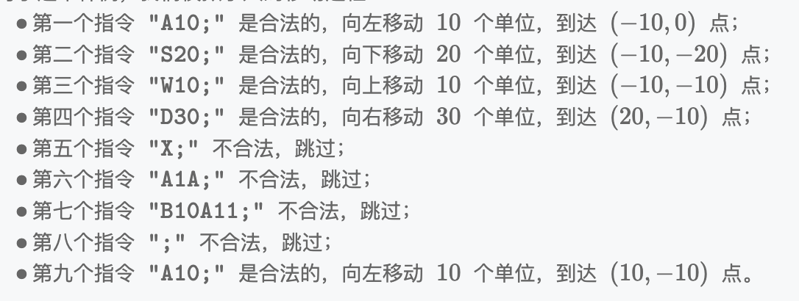

# 坐标移动

## 题目描述

我们定义一个无限大的二维网格上有一个小人,小人初始位置为(0,0)点,小人可以读取指令上下左右移动。
一个合法的指令由三至四个符号组成:

- 第一个符号为"A/D/W/S"中的一个,代表小人移动的方向;分别代表向左、向右、向上、向
  下移动;记某个时刻小人的坐标为(2,y),向左移动一格即抵达(x-1,1,g)、向右移动一格即抵达(x+1,y)、向上移动一格即抵达(2,y+1)、向下移动一格即抵达(x,)-1)。
- 最后一个符号为";",代表指令的结束,该符号固定存在;
- 中间为一个 1-99 的数字,代表小人移动的距离。

如果你遇到了一个不合法的指令,则直接忽略;例如,指令"A100;"是不合法的,因为 100 超出了 1-99 的范围;"Y10;"也是不合法的,因为 Y 不是"A/1D/W/S"中的一个。

输出小人最终的坐标。

## 输入描述:

在一行上输入一个长度 1<length(s) 104,仅由可见字符构成的字符串 8,代表输入的指令序列。

## 输出描述:

在一行上输出一个两个整数,代表小人最终位置的横纵坐标,使用逗号间隔。

## 示例

输入：A10;S20;W10;D30;X;A1A;B10A11;;A10;
输出：10,-10

解释：对于这个样例，我们模拟小人的移动过程：

## 解题思路

1. 我们可以保存两个变量，分别存储小人的 x 和 y 轴的移动位置
2. 需要首先排查不合法的输入
