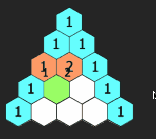

# 杨辉三角-118-yanghuiTriangle

## 题目要求

给定一个非负整数 numRows，生成「杨辉三角」的前 numRows 行。

在「杨辉三角」中，每个数是它左上方和右上方的数的和。

示例 1:

输入: numRows = 5
输出: [[1],[1,1],[1,2,1],[1,3,3,1],[1,4,6,4,1]]
示例 2:

输入: numRows = 1
输出: [[1]]

提示:

1 <= numRows <= 30

## 解题方案

一、递归

- 当行数 n 为 0 时，返回[];
- 当行数 n 为 1 时，返回[1];
- 递归获取前几行的结果 res = generate(n - 1)
- 拿到最后一行的数据 lastRow = res[res.length - 1]
- 初始化新行数据，值为 1，newRow = [1]；
- 遍历最后一行数据 lastRow，动态生成当前行数据，newRow.push(lastRow[i - 1] + lastRow[i]);
- 当前行最后一个数值为 1
- 将最后一行数据 push 到前几行数据值 res 中，返回 res 即为目标值

二、动态规划

- 初始化一个二维数组 res，用于存放杨辉三角的结果
- 遍历行数 numRows，生成每一行的数据
- 每一行的数据都是一个长度为 i+1 的数组，初始化为 1
- 从第二个元素开始，到倒数第二个元素结束，每个元素的值都等于上一行的前一个元素和上一行的当前元素之和
- 返回 res
