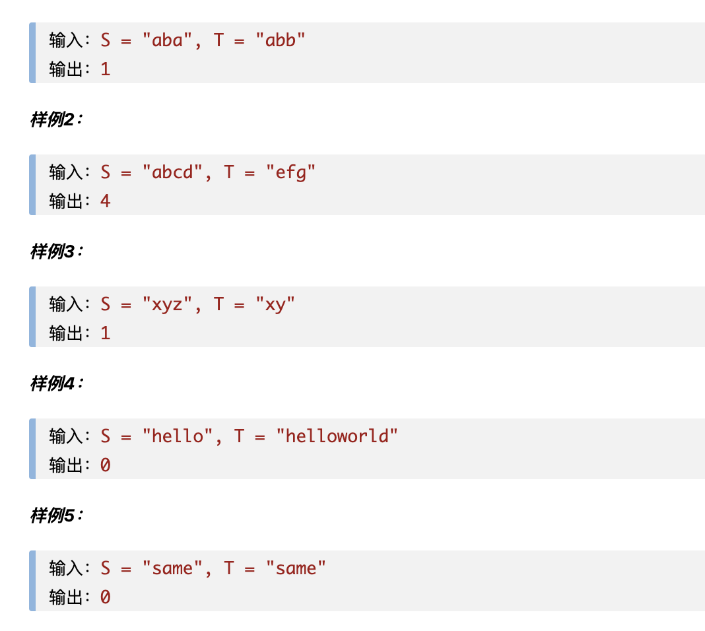

# [最少前缀操作问题-marscode15 ](https://www.marscode.cn/practice/0rrwy9yleqeoye?problem_id=7424418560931168300)

小 U 和小 R 有两个字符串，分别是 S 和 T，小 U 要通过对 S 进行若干次操作，使其变成 T 的一个前缀。操作包括修改 S 的某一个字符，或者删除 S 末尾的字符。需要帮助小 U 计算出最少需要多少次操作能让 S 变成 T 的一个前缀。

## 样例

## 思路

思路：

- 首先排除特殊情况，比如两数相等，以及第一个字符已经是第二个字符的前缀的情况
- 采用双指针解法，定义两个指针，分别控制两个字符串的遍历
- 只需考虑 s 字符串长度大于等于 t 字符串长度的情况，因为只匹配前缀
- 如果两个字符相等，无需任何操作继续遍历，两个指针后移
- 如果两个字符串不相等，则可以直接修改 s 字符，使其等于 t 字符当前的值，然后两个指针后移
- 当其中一个字符串遍历完成时循环结束，循环结束后 s 字符串如有剩余，直接删除，次数为 s 剩余的长度
