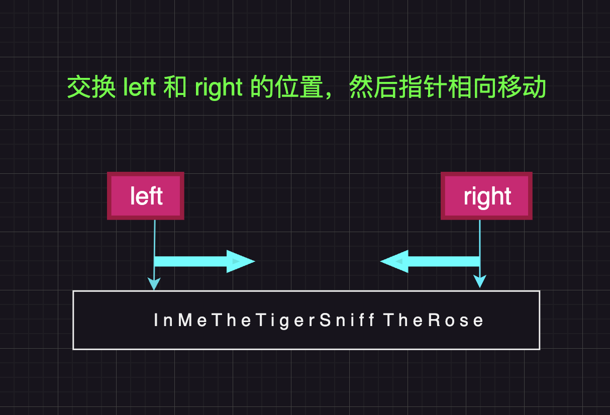

# 翻转字符串

编写一个函数，其作用是将输入的字符串反转过来。输入字符串以字符数组 s 的形式给出。

不要给另外的数组分配额外的空间，你必须原地修改输入数组、使用 O(1) 的额外空间解决这一问题。

示例 1：

输入：s = ["h","e","l","l","o"]
输出：["o","l","l","e","h"]
示例 2：

输入：s = ["H","a","n","n","a","h"]
输出：["h","a","n","n","a","H"]

# 要求解读

1. 这个比较简单，我们只需将首尾对称的元素交换位置即可
2. 相当于循环交换两数位置了

# 解题思路

1. 我们可以使用双指针 left 和 right,left 初始为 0，right 初始为 length-1
2. 交换 left 和 right 对应的位置
3. 指针同时向后移动

